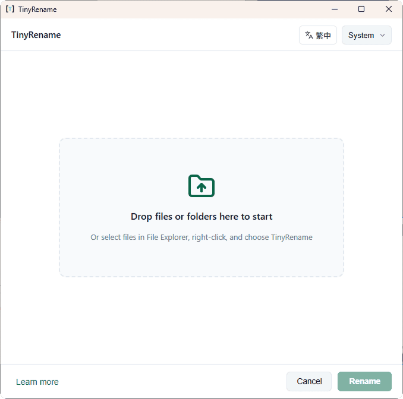
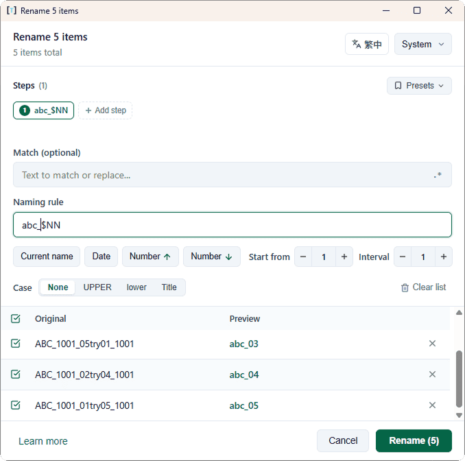
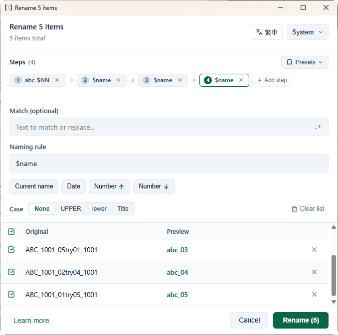
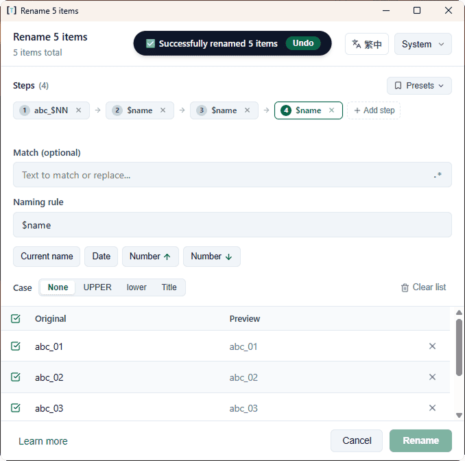
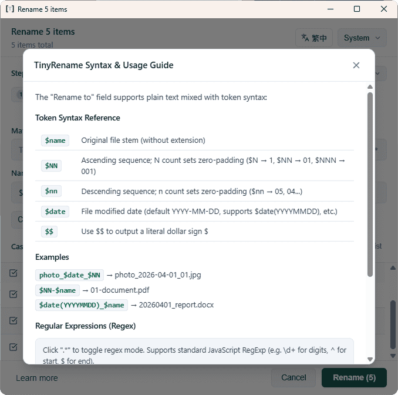

<div align="center">

# TinyRename

<p align="center">
  <strong>Minimalist, blazing-fast, and intuitive batch file/folder rename tool for Windows</strong><br>
  <em>Inspired by the design philosophy of Figma's Rename Dialog—compose rules with simple clicks instead of memorizing regex</em>
</p>

<p align="center">
  <a href="README.md">繁體中文</a> •
  <a href="#-screenshots">Screenshots</a> •
  <a href="#-download--installation">Download</a> •
  <a href="#-key-features">Key Features</a> •
  <a href="#-authors-note">Author's Note</a> •
  <a href="#-ai-disclosure">AI Disclosure</a>
</p>

[](https://github.com/kuozher/tinyrename/releases)
[](LICENSE)
[](https://github.com/kuozher/tinyrename)

</div>

---

## 📸 Screenshots

| Startup Empty State (Full window drag & drop) | Real-time Diff Preview on File Import |
| :---: | :---: |
|  |  |

| Multi-Step Rule Pipeline & Presets Dropdown | Sequence Steppers & Final Diff Comparison |
| :---: | :---: |
|  |  |

<div align="center">
  <p><strong>💡 Built-in "Learn more" Syntax Reference Popover</strong></p>
  
</div>

---

## 💬 Author's Note

> "I couldn't really understand regex, and I found Figma's rename dialog much more natural to use, so I quickly put together a simple configuration. Most of the time, I just needed to add sequence numbers to a bunch of files—less hassle is always better, simplicity and convenience first."

---

## 🤖 AI Disclosure

> This project utilized Google Gemini CLI (`agy`) invoking Claude 3.7 / Opus 4.6 for the Product Requirements Document (PRD), and was implemented using Gemini 3.8 Flash (High). Subsequent UI refinement, logic adjustments, workflow operations, and verification were conducted manually by myself.

---

## 📥 Download & Installation

Visit the [GitHub Releases Page](https://github.com/kuozher/tinyrename/releases) to download:

| Package Type | File Name | Description |
| :--- | :--- | :--- |
| **Installer (NSIS)** | `TinyRename_0.1.0_x64-setup.exe` | **Recommended**. Automatically registers Windows Explorer right-click context menu for files and folders. Clean uninstallation, file size only ~1.4 MB. |
| **Portable (ZIP)** | `TinyRename_0.1.0_x64-portable.zip` | Standalone executable without installation. Includes one-click `.bat` scripts to register or unregister the right-click menu anytime. |

---

## ✨ Key Features

- 🎨 **Figma-inspired Intuitive Experience**: Semantic token buttons (`Current name`, `Date`, `No. ↑`, `No. ↓`) replace tedious regex syntax. Click to insert and compose.
- 🔗 **Rule Chaining Pipeline**: Add multiple rename passes sequentially (e.g., Step 1: Clean prefix ➔ Step 2: Convert to lowercase ➔ Step 3: Append sequence numbers). Real-time pipeline previews.
- ⚡ **Preset Library**: Built-in common presets (Photo date, Document numbering, Lowercase, etc.), plus one-click saving of custom rules for future reuse.
- 🖱 **Windows Context Menu & Single-Instance**: Select multiple files or folders in Windows File Explorer, right-click "使用 TinyRename 重新命名". Secondary instances automatically route into the existing window without spamming multiple windows.
- ⚡ **Ultra-lightweight & High Performance**: Built with Tauri 2 + Rust. Native virtual rendering keeps table scrolling at a locked 60 FPS even with 1,000+ files.
- 🛡 **Multi-layer Safety & Guardrails**:
  - **Extension Protection**: File extensions are strictly preserved and never accidentally modified.
  - **Live Conflict Detection**: Name collisions and illegal Windows characters are highlighted with instant button lock.
  - **Windows MAX_PATH (260 chars) Warning**: Proactively warns against paths exceeding the 260-character Windows limit.
  - **Safe Case Renaming**: Implements two-step rename to handle Windows NTFS case-insensitivity cleanly.
- ↩ **One-Click Undo**: Revert the previous batch operation with a single click or `Ctrl+Z`. Operations log saved automatically.
- 🌐 **Bilingual & Adaptive Theming**: Instant switching between Traditional Chinese and English. Follows system dark/light mode with WCAG AAA contrast ratio compliance.

---

## 🏷 Syntax Reference

| Token Chip | Syntax | Description | Example |
| :--- | :--- | :--- | :--- |
| **Current name** | `$name` | Original filename stem (without extension) | `photo_$name` → `photo_IMG_01.jpg` |
| **No. ↑** | `$NN` | Ascending sequence; count of `N` sets zero padding | `$N` (1), `$NN` (01), `$NNN` (001) |
| **No. ↓** | `$nn` | Descending sequence; count of `n` sets zero padding | `$nn` (05, 04, 03...) |
| **Date** | `$date` | File modification date (default `YYYY-MM-DD`) | `photo_$date` → `photo_2026-04-01.jpg` |
| **Custom Date** | `$date(...)` | Custom format (e.g. `YYYYMMDD`) | `$date(YYYYMMDD)` → `20260401` |
| **Literal Dollar** | `$$` | Outputs literal `$` character | `item_$$100` → `item_$100.txt` |

- **Sequence Steppers**: Automatically revealed inline when sequence tokens are present to adjust `Start` and `Step`.
- **Case Conversion**: Segmented control for `None` / `UPPER` / `lower` / `Title Case`.
- **Match Filter**: Substring filter or toggle `.*` for full regular expression replacements.

---

## 🛠 Development & Build

### Requirements
- [Node.js](https://nodejs.org/) (18+) & npm
- [Rust](https://www.rust-lang.org/) (1.77+) & Cargo
- Windows 10 / 11

### Commands
```bash
# 1. Install dependencies
npm install

# 2. Local development with HMR
npm run tauri dev

# 3. Run unit tests
npm test

# 4. Build release installer (NSIS)
npx tauri build
```

---

## 📄 License

This project is licensed under the [MIT License](LICENSE).
